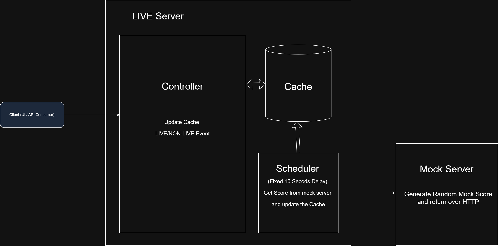

## Build and Deploy Instructions [Sequence]

### Checkout main branch
- git clone -b https://github.com/manojschaudhari/live-event-server.git
- OR Donwload ::: https://github.com/manojschaudhari/live-event-server/archive/refs/heads/main.zip

### Test
- mvn clean test surefire-report:report-only -Dmaven.test.failure.ignore=true
- Report path ::: live-server\target\reports\surefire.html 

### Build ::: Must Before starting the server modules
mvn clean compile -DskipTests

### Start Mock Server
- cd mock-server
- mvn clean compile exec:java -Dexec.mainClass="com.example.app.MockServer"
- Swagger URL ::: http://localhost:9090/swagger-ui/index.html
- Health URL ::: http://localhost:9090/actuator/health

### Start LIVE Server
- cd live-server
- mvn clean compile exec:java -Dexec.mainClass="com.example.app.LiveEventServer"
- Swagger URL ::: http://localhost:8080/swagger-ui/index.html
- Health URL ::: http://localhost:8080/actuator/health

## Design and Implementation
---

---
### Modules
** 1. mock-server **
* Mock REST APIs
* Cleans message store
* Starts RocketMQ broker

** 2. live-server **
* JSON POST Rest Endpoints
* Cache management (ConcurrentHashmap)
* MQ publisher
* CDC consumer integration
* Processes :
  * Event Status Endpoint
  * Periodic REST Calls for Mock Score update
  * Publish score updates to CDC consumer
  * MQ Consumption error publish on dead-queue.log <<< Can be replayed 
  * Error Handling & Logging
  * Test Cases

## Vibe Coding 
- Generated and validated test cases using ChatGPT
- 

